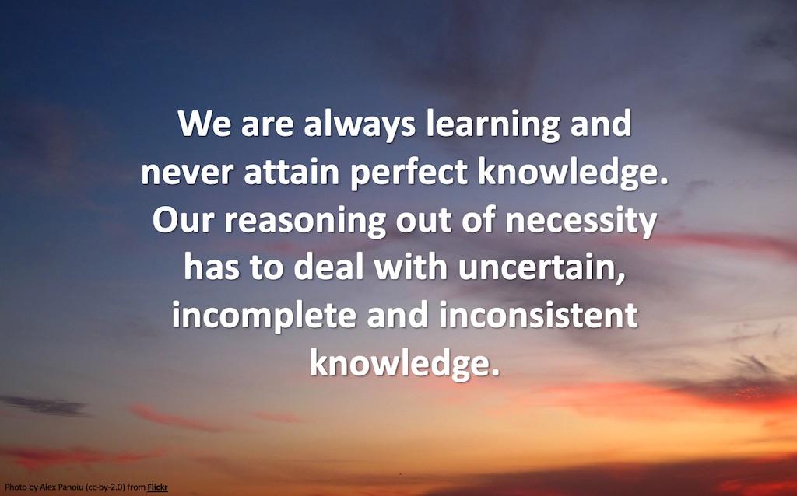

# First International Workshop on Representing and Reasoning with Imperfect knowledge

* May 3, 2022, at 9-10:30 AM EST - an online workshop as part of the [Knowledge Graph Conference (KGC-2022)](https://www.knowledgegraph.tech).

Talks (12 minutes each including Q&A) preceded by a brief introduction by the chairs:
* **Plausible reasoning with imperfect knowledge**, Dave Raggett, W3C/ERCIM ([Slides](IKG-22-Raggett-2022-05-03.pdf))
* **Use cases for imperfect knowledge**, William Van Woensel, NICHE Research Group, Dalhousie University
* **Causal reasoning**, Utkarshani Jaimini, AI Institute, University of Southern Carolina
* **Commonsense knowledge**, Filip Ilievski, Information Sciences Institute, University of Southern California ([Slides](IKG-22-Ilievski-2022-05-03.pdf))
* **Literature-Based Discovery**, Ali Daowd, NICHE Research Group, Dalhousie University

Followed by round-table discussions on use cases, requirements, and technical directions ([Slides](IKG-22-issues-2022-05-03.pdf))

Organisers:  Dave Raggett (W3C/ERCIM), William Van Woensel (NICHE Research Group at Dalhousie University)

## Abstract:

This workshop will address uses cases and techniques for representing and reasoning with imperfect knowledge graphs, i.e., including knowledge that is uncertain, incomplete and inconsistent. Deductive reasoning will have limited usefulness to extend imperfect knowledge graphs, as it assumes knowledge that is wholly truthful - i.e., perfect knowledge. This workshop investigates the use of plausible reasoning over knowledge graphs including imperfect knowledge, where mathematical proof is replaced by plausible arguments for and against a given premise - in other words, everyday reasoning!

The foundations for this were laid by Alan Collins and his colleagues back in the 1980’s, building upon earlier work on semantic networks, and far earlier work in Ancient Greece in respect to ideas about argumentation. We plan to focus primarily, but not exclusively, on use cases for healthcare, and will discuss technical approaches for plausible reasoning in all of its forms, including, but not limited to, argumentation, causal reasoning, case-based reasoning, reasoning by analogy, inductive reasoning, abductive reasoning, statistical inference, qualitative reasoning and fuzzy logic. We also welcome demonstrations and evaluations of proof-of-concept implementations.

## Workshop Introduction:

Knowledge graphs provide a flexible means to integrate a wide variety of information sources, including models describing concepts, their properties and inter-relationships. When it comes to dealing with uncertain, incomplete and inconsistent knowledge, it is often impractical to apply formal logic or statistical approaches, although imperfect knowledge is frequently the case in everyday life. Plausible reasoning has been studied since the days of Ancient Greece, e.g., Carneades and his guidelines for argumentation, followed by a long line of philosophers. Today, it is widely used in court cases, where the prosecution and defence make plausible arguments for and against the innocence of the accused, the judge rules on what is admissible as evidence, and the jury decide on the basis of the arguments presented.

Plausible reasoning can be used with causal models to provide explanations or predictions, and is also an important part of natural language understanding, e.g. finding the most plausible interpretation of an utterance involves selecting which meaning for each word best fits the context as inferred from nearby words and prior knowledge. Understanding is the process of finding and reasoning about plausible explanations. Plausible reasoning moves from plausible premises to conclusions that are less plausible, but nonetheless rational, and is based on the way things generally go in familiar situations. Plausibility is reinforced when listeners have examples in their own minds. Examples can be used to confirm or refute reasoning. Questions can be used to probe reasoning at a deeper level, as well as to seek evidence that strengthens or weakens the argument.

Plausible reasoning further includes fuzzy reasoning, where a system is considered to be in a mix of different states at the same time, and qualitative reasoning, which deals with qualitative modelling of physical processes. Plausible reasoning is related to Bayesian inference, which provides a statistical basis for dealing with uncertainties when the corresponding statistics are available. In the absence of such statistics, plausible reasoning relies on qualitative equivalents in respect to prior knowledge and conditional likelihoods. In other words, plausible reasoning involves the combination of symbolic knowledge with sub-symbolic metadata. This holds the potential for radical changes to information technology, with new kinds of databases and systems that process information more like we do.

Alan Collins and colleagues in the 1980's developed a core theory of plausible reasoning based upon analysis of recordings of peoples' reasoning. Collins and Michalski found that:

1. There are several categories of inference rules that people commonly use to answer questions.
2. People weigh the evidence that bears on a question, both for and against.
3. People are more or less certain depending on the certainty of the premises, the certainty of the inferences, and whether different inferences lead to the same or opposite conclusions.
4. Facing a question for which there is an absence of directly applicable knowledge, people search for other knowledge that could help given applicable inferences.

* See: [The logic of plausible reasoning: a core theory, Collins and Michalski, 1988](https://www.sciencedirect.com/science/article/abs/pii/0364021389900104)

## Workshop Organization:

This workshop will take place online, and consist of a mix of short talks, demonstrations and round-table discussion around use cases, requirements and techniques for extending imperfect knowledge graphs (KG). We invite position statements which will be used to guide the design of the workshop agenda. **Please contribute your ideas to the [GitHub issue tracker](https://github.com/Imperfect-Knowledge/ik2022/issues), either by responding to existing issues or by creating new ones**. We are looking for suggestions for discussion topics, and what you would like to have presented to help with the discussion. Please email ik2022@googlegroups.com if you want to chat with the organisers directly, e.g. to provide names and contact details for people you think we should invite.

Representing and dealing with imperfect knowledge isn’t a well established area as yet, albeit one with a long history of related work. We therefore encourage discussion on its scope and relationship to other research areas, with a view to avoiding barriers between different research silos. Interdisciplinary exchanges are very helpful to inspiring new insights. As an example, work on plausible reasoning will complement work on natural language processing, and enable cooperative human-machine dialogues. A similar case holds for neurosymbolic AI, presenting opportunities for exchanging ideas between researchers working on knowledge graphs for plausible reasoning, and other researchers working on neural networks.

Here are some examples of health related use cases involving imperfect knowledge:

* Computer-aided diagnosis: a clinician will typically deal with an incomplete patient picture, and, using plausible reasoning such as abduction, generalization, and analogy, they narrow down the many options to only several.

* Computer-interpretable guidelines: a clinical action (e.g., prescription of drug) will have an intended effect, but with a certain belief (or likelihood). Effects of drugs can also have probability distributions in time, as per pharmacology studies. Given a workflow of tasks, each affecting the patient in different ways and with different likelihoods, planning a “care path” involves searching for an optimal path towards a target state.

* Incomplete health KG: missing causal associations in health KG, such as between diagnosis and treatments, can be found via plausible reasoning over curated, large-scale medical knowledge. For instance, using medical hierarchies and relations, one can find the most specific body part to which both diagnosis and treatment apply.

* Literature-based discovery: given a literature-based KG, built with relations and concepts extracted from clinical literature (using NLP) is typically imperfect; by applying plausible reasoning (e.g., using word embeddings such as TransE), the identification missing relations may lead to the discovery of previously unknown links in the medical literature.

We welcome short descriptions of health related use cases, such as above, as well as use cases for other sectors that can help to identify requirements for extending knowledge graphs for dealing with imperfect knowledge. One such use case would be safety argumentation, another might be reasoning in respect to ethical considerations. We are sure that you will have many other suggestions. 

An example of a potential notation for plausible knowledge and its use for reasoning can be seen in the web-based demo at: https://www.w3.org/Data/demos/chunks/reasoning/. This work was inspired by Collins's theory of plausible reasoning, and points to opportunities for further work on richer ways to reason, including support for Daniel Kahneman's System 1 and 2 thinking.
